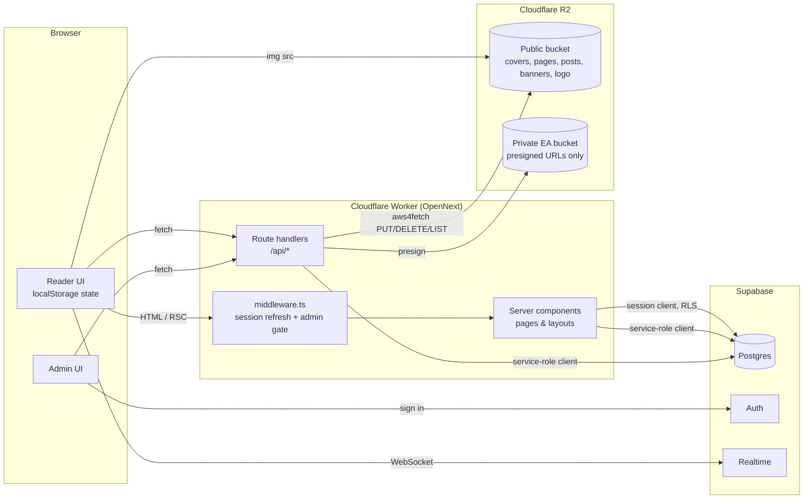

# 1. Overview

## What it is

Ryuwanshoy is a comic / manhwa publishing site for a single Filipino creator. It has two halves:

- **Public reader** — anyone can browse series, read chapters (free, no ads, no paywall), look at illustrations, comment anonymously, and bookmark things. There are no reader accounts.
- **Admin dashboard** — one authenticated admin creates series and chapters, uploads and reorders pages, publishes illustrations, curates the homepage hero banner, reads notifications and edits site settings.

## Feature summary

### Reader side

| Feature | Notes |
|---------|-------|
| Series catalogue | `/comics` with status/genre filters, sort, search and age filtering |
| Series detail | Cover, badges, START READING / CONTINUE / BOOKMARK / SHARE, chapter list with read-state, comments |
| Chapter reader | Two modes — **scroll** (vertical) and **flip** (page-turn book) — with chapter picker, prev/next, hideable UI |
| Reading progress | Remembered per series in the browser; "Continue reading" on the home page and series page |
| Illustrations ("posts") | Sketch / drawing / meme / other; modal with likes and threaded comments |
| Bookmarks | Series bookmarks stored locally, listed at `/bookmarks` |
| Age gate | Self-reported 13 / 16–17 / 18 selection; listings are filtered by each series' `min_age` |
| Dark mode | Site-wide toggle, remembered, no flash on load |
| Live updates | Home and illustrations pages subscribe to Supabase Realtime |
| Donate | `/donate` with Ko-fi/Patreon/PayPal links from settings, plus an FAQ |
| Early Access signup | `/early-access` — reCAPTCHA-protected email list. **Currently disabled by flag.** |
| SEO | Per-page metadata, Open Graph/Twitter cards, `sitemap.xml`, `robots.txt` |

### Admin side

| Feature | Notes |
|---------|-------|
| Login / password reset | Supabase Auth email + password, recovery-link flow |
| Dashboard | Published series preview, draft list, hero banner manager, quick-create, notification bell |
| Series wizard | 3-step create flow: details → first chapter pages → review/publish |
| Chapter management | Create, edit, publish, delete; drag-to-reorder page uploader; two-page spread flag |
| Drafts | Everything unpublished, with completeness checklists |
| Illustrations | Create/edit/delete posts with type and image |
| Hero banners | Up to 5 homepage slides, ordering and visibility |
| Early Access list | View, delete and CSV-export signups |
| Settings | Site info, donation links, social links, admin email/password |
| Notifications | New comments and likes, unread badge, realtime |
| Storage meter | R2 usage against a 10 GB cap |

## Technology stack (as actually installed)

| Layer | Tool | Notes |
|-------|------|-------|
| Framework | **Next.js 16.2** (App Router, Turbopack in dev, webpack for the production build) | `package.json` `build` = `next build --webpack` |
| UI runtime | **React 19.2** | |
| Language | **TypeScript 5**, `strict` + `noUncheckedIndexedAccess` | Path alias `@/*` → `src/*` |
| Styling | **Tailwind CSS 4** + CSS custom properties (`--ryu-*`) | Tokens in `src/app/globals.css` |
| Components | shadcn-style primitives on **`@base-ui/react`** | `components.json` style `base-nova`; icons via `lucide-react` |
| Font | **Fredoka** (Google font via `next/font`) | One font for everything |
| Drag & drop | `@dnd-kit/*` | Page reordering |
| Page-turn | `react-pageflip` | Flip reader |
| Toasts | `sonner` | |
| Database & Auth | **Supabase** (`@supabase/ssr`, `@supabase/supabase-js`) | Postgres + Auth + Realtime |
| File storage | **Cloudflare R2** via `aws4fetch` | S3-compatible, SigV4-signed `fetch` |
| Hosting | **Cloudflare Workers** via `@opennextjs/cloudflare` + `wrangler` | See [Deployment](./13-deployment-and-operations.md) |
| Monitoring | `@sentry/nextjs` | Partially enabled — see [Known issues](./14-known-issues-and-roadmap.md) |
| Bot protection | Google reCAPTCHA v2 (`react-google-recaptcha`) | Early Access form only |
| Email list | Mailchimp REST (optional) | Fire-and-forget sync on signup |
| Lint/format | ESLint 9 (`eslint-config-next`), Prettier 3 | |

Installed but **not used** by application code: `leo-profanity`, `date-fns`, `@aws-sdk/client-s3`, `@aws-sdk/s3-request-presigner`, `@cf-wasm/photon` (only referenced by an unused file). See [Known issues](./14-known-issues-and-roadmap.md#unused-dependencies).

## High-level architecture



## Repository layout

```
.
├── docs/                    ← you are here
├── public/                  Static images (logo.png, Rlogo.png, login.png, pen.png, pipilabu.png)
├── src/
│   ├── middleware.ts        Session refresh + /admin and admin-API gate
│   ├── app/                 Routes (App Router)
│   │   ├── layout.tsx       Root layout: font, theme init script, AgeGate, Navbar/Footer
│   │   ├── globals.css      Design tokens + Tailwind 4 setup
│   │   ├── page.tsx         Home
│   │   ├── (components)/    Client halves of Home and Posts pages
│   │   ├── comics/          Catalogue, series detail, chapter reader
│   │   ├── posts/ bookmarks/ donate/ early-access/
│   │   ├── admin/           Dashboard and all admin pages
│   │   ├── api/             Route handlers (see API reference)
│   │   └── robots.ts sitemap.ts error.tsx not-found.tsx loading.tsx
│   ├── components/
│   │   ├── ui/              shadcn-style primitives
│   │   ├── shared/          Navbar, Footer, AgeGate, SeriesHeader, ChapterList, ThemeToggle…
│   │   ├── reader/          ReaderShell, ScrollReader, FlipReader, ReaderTopBar, PostModal, SeriesComments
│   │   └── admin/           Sidebar, Dashboard*, HeroBannerManager, NotificationBell
│   │       └── reader/      Public-facing home/catalogue components (see note in Components doc)
│   ├── hooks/               useRealtimeSubscription, useRyuTheme
│   ├── lib/                 supabase clients, r2, auth, rate-limit, theme, image helpers…
│   └── types/               database.ts (generated), reader.ts
├── supabase/                Only `.temp/` (CLI link info) is tracked — no migrations in the repo
├── next.config.ts           Headers/CSP, images, Sentry wrapper
├── open-next.config.ts      OpenNext (Cloudflare) config
├── wrangler.jsonc           Worker name, bindings, observability
├── sentry.{client,server,edge}.config.ts
└── CLAUDE.md / claude.md    "Do not edit" list for Claude Code
```

## Glossary

| Term | Meaning |
|------|---------|
| **Series** | A comic title (`series` table). Has slug, cover, genre, status, `min_age`, `is_published`. |
| **Chapter** | A numbered installment of a series (`chapters`). Unique `chapter_number` per series. |
| **Page** | One image in a chapter (`pages`), ordered by `page_number`. |
| **Spread** | A landscape page meant to be read as two facing pages (`pages.is_spread`). |
| **Post / Illustration** | A standalone image outside the chapter structure (`posts`). Types: sketch, drawing, meme, other. In the admin UI they are called *Illustrations*. |
| **Hero slide** | A homepage carousel banner (`hero_slides`), max 5, optionally linked to a series and chapter. |
| **Draft** | Unpublished content. For series: `is_published = false`. For chapters: `is_published = false` and/or `is_draft = true` (see [Database](./06-database.md#draft-vs-published)). |
| **Early Access (EA)** | A planned feature: chapters gated behind a private R2 bucket and an entitlement check. The rule for *who* gets access is not decided; the feature is disabled. |
| **Age gate** | A self-reported age band stored as `ryu-age`; series with a higher `min_age` are hidden from listings. |
| **`--ryu-*` tokens** | The project's CSS custom properties. All colours must come from them. |
| **`edit_token`** | Random secret returned once when an anonymous comment is posted; lets that browser edit/delete it later. |
| **`like_token`** | Random per-browser id used to make likes toggle-able without accounts. |
| **Service-role client** | Supabase client using `SUPABASE_SERVICE_ROLE_KEY`; bypasses RLS; server-only. |
