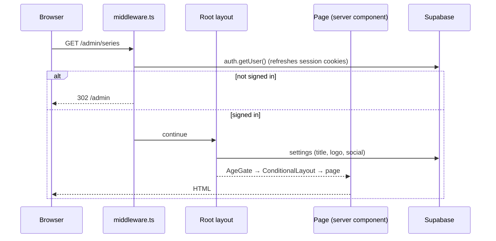

# 3. Architecture

## Request lifecycle

1. **`src/middleware.ts`** runs only for `/admin`, `/admin/*`, `/api/early-access(/*)` and `/api/settings`. It refreshes the Supabase session cookie and applies the coarse admin gate ([details](./09-auth-and-security.md#middleware)). Every other route never touches it.
2. **`src/app/layout.tsx`** (`revalidate = 0`) loads the `settings` row, loads Fredoka, injects the theme init script into `<head>`, then wraps the tree in `AgeGate` → `ConditionalLayout`, and mounts the Sonner `<Toaster>`.
3. **`ConditionalLayout`** decides the chrome: `/admin/*` and reader URLs (`/comics/<slug>/<chapter>`) render **without** Navbar/Footer; everything else gets both.
4. **`AgeGate`** blocks all non-admin pages with a full-screen overlay until an age band is stored.
5. The **page** fetches its data (server component) and hands it to client components as props.

## Three ways to talk to Supabase

| Client | File | Key | RLS | Runs on | Typical use |
|--------|------|-----|-----|---------|-------------|
| Browser | `src/lib/supabase/client.ts` | anon | applies | browser | Auth (login, reset, sign-out), Realtime channels |
| Server session | `src/lib/supabase/server.ts` | anon + user's cookies | applies | server | Server-component reads; admin dashboard reads; early-access insert |
| Service role | `src/lib/supabase/admin.ts` | `SUPABASE_SERVICE_ROLE_KEY` | **bypassed** | server only (`server-only`) | All `/api/*` handlers; some public page reads |

`supabaseAdmin` is exported as a **lazy `Proxy`**: each property access builds a fresh client inside the current request. That avoids constructing a client (and reading env vars) at module load time, which fails on Workers. `getsupabaseAdmin()` (note the lower-case `s`) returns a client directly and is used by `rate-limit.ts`.

**Rule of thumb in this codebase:** anything a *visitor* can trigger that needs elevated access (comments, likes, rate limits, EA signup checks) goes through an API route using the service-role client after validating input; client components never receive the service-role key or import `server-only` modules.

### Which pages use which client

| Page | Client(s) |
|------|-----------|
| `/` | session client (hero slides, latest chapters, posts) + service client (settings, metadata) |
| `/comics`, `/bookmarks`, `/posts` | session client |
| `/comics/[slug]` | session client |
| `/comics/[slug]/[chapter]` | session client for series/chapter/neighbours + **service client for `pages`** |
| `sitemap.ts` | service client |
| `/admin/*` server pages (dashboard, drafts) | session client (the admin's own session) |
| `/admin/*` client pages | `fetch('/api/…')` (service client behind `requireAdmin`) |

This means public reads through the session client depend on **RLS allowing anonymous `select`** on published rows. See [Database → RLS](./06-database.md#row-level-security).

## Rendering strategy

| Route | Strategy | Why |
|-------|----------|-----|
| Root layout | `revalidate = 0` | Always fetch fresh site title/logo/social links |
| `/` | ISR `revalidate = 60` + client refetch on Realtime events | Fast page with near-live updates |
| `/comics` | ISR `revalidate = 60` | Catalogue stats |
| `/posts` | ISR `revalidate = 60` (`?type=` variants) | |
| `/comics/[slug]` | `force-dynamic` | Chapter list and counts must be current |
| `/comics/[slug]/[chapter]` | `force-dynamic` | Never serve stale/unpublished pages |
| `/bookmarks` | `force-dynamic` | |
| `/sitemap.xml` | `revalidate = 3600` | Hourly rebuild |
| `/donate`, `/early-access` | Client components that `fetch('/api/settings')` | Settings are editable at runtime |
| `/api/pages`, `/api/drafts`, `/api/posts`, `/api/settings`, `/api/notifications`, `/api/upload-logo` | `dynamic = 'force-dynamic'` (+ `runtime = 'nodejs'` on several) | Never cache |

## Realtime

`src/hooks/useRealtimeSubscription.ts` opens a Supabase Realtime channel and subscribes to `postgres_changes` (`event: '*'`, `schema: 'public'`) for one or more tables, calling `onChange` on any event.

| Channel | Tables | Consumer |
|---------|--------|----------|
| `home-comics` | `chapters`, `series`, `hero_slides` | `HomeClient` |
| `home-posts` | `posts` | `HomeClient` |
| `posts-realtime` | `posts` | `PostsClient` |
| `notif-bell` | (comments/likes) | `NotificationBell` (admin) |

> The Home page's refetch handlers currently mis-read the API responses — see [Known issues #1](./14-known-issues-and-roadmap.md#1-home-page-realtime-refetch-blanks-content).

## Why the code looks the way it does: Cloudflare Workers constraints

The app runs on Cloudflare Workers. Three platform limits shaped the design; the comments in `src/lib/r2.ts`, `src/lib/image-processing.ts`, `src/lib/image-compress.ts` and `next.config.ts` record the history.

| Constraint | Consequence in code |
|-----------|---------------------|
| **CPU-time budget per request** (10 ms on the free plan). The AWS SDK's SigV4 signing plus base64 handling of large images tripped *error 1102: Worker exceeded CPU time limit*. | R2 access uses **`aws4fetch`** (tiny, fetch-based) instead of `@aws-sdk/client-s3`; images are **compressed in the browser** (`compressImage`) before upload so the Worker only touches small payloads. |
| **No runtime WebAssembly compilation** — `sharp` cannot run. | Server-side resizing was replaced first by the Cloudflare Images binding, then Photon WASM; both hit platform/bundling problems. **Current state: uploads store the original bytes.** |
| **`env.IMAGES` binding crashes** (platform bug, documented in `image-processing.ts`). | `images.unoptimized = true` in `next.config.ts` — `next/image` serves the R2 original directly. |

Practical implications for contributors:

- Don't add Node-only libraries that need native modules or runtime WASM compilation.
- Keep request handlers light; do heavy image work in the browser.
- Route handlers that need Node APIs declare `export const runtime = 'nodejs'`.

## Images

`next/image` is used throughout but with `unoptimized: true`, so it emits plain `` with the original URL. Remote images must be on an allowed host: `next.config.ts` `remotePatterns` and the CSP `img-src` both list the R2 public host (currently hard-coded — see [Known issues](./14-known-issues-and-roadmap.md#hard-coded-r2-hostname)).

## Error, loading and not-found UI

| File | Behaviour |
|------|-----------|
| `src/app/error.tsx` | Client error boundary with a retry button; logs the error to the console |
| `src/app/not-found.tsx` | 404 page |
| `src/app/loading.tsx` | Skeleton for the home page (includes a "continue bar" skeleton) |

There is no `global-error.tsx`.

## Monitoring

Sentry is wired through `withSentryConfig` in `next.config.ts`, with three init files at the repo root. Client init is enabled only when `NODE_ENV === 'production'`; **server and edge inits are `enabled: false`**, and there is no `instrumentation.ts`. `tracesSampleRate` is `1.0` everywhere. Cloudflare's own observability (logs + traces, 100% sampling, persisted) is enabled in `wrangler.jsonc`.

## Cross-cutting patterns

- **Server-only enforcement:** modules that must never reach the browser start with `import 'server-only'` (`r2.ts`, `rate-limit.ts`, `supabase/admin.ts`, `ea-entitlement.ts`, `image-processing.ts`, every route handler).
- **Admin check first:** mutating handlers begin with `const auth = await requireAdmin(); if (auth instanceof NextResponse) return auth`.
- **Fire-and-forget cleanup:** after a successful DB delete, R2 objects are deleted without awaiting (`deleteFromR2(...).catch(console.error)`), so an orphaned file is possible but a failed R2 delete never blocks the admin.
- **Cache-busting URLs:** `uploadToR2` returns `…?v=<timestamp>`; stable filenames (e.g. `cover-<slug>`) are reused on re-upload while URLs still change.
- **Optimistic client + realtime:** admin actions mutate through the API; public pages refresh via Realtime.
- **`localStorage` as the reader's database:** see [Reader & client state](./11-reader-and-client-state.md).
