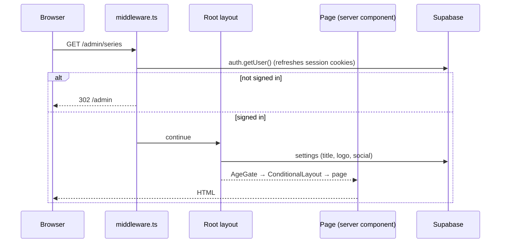

# 3. Architecture

## Request lifecycle

```mermaid
sequenceDiagram
    participant B as Browser
    participant MW as middleware.ts
    participant L as Root layout
    participant Pg as Page (server component)
    participant DB as Supabase

    B->>MW: GET /admin/series
    MW->>DB: auth.getUser() (refreshes session cookies)
    alt not signed in
        MW-->>B: 302 /admin
    else signed in
        MW->>L: continue
        L->>DB: settings (title, logo, social)
        L-->>Pg: AgeGate → ConditionalLayout → page
        Pg-->>B: HTML
    end
```

1. **`src/middleware.ts`** runs only for `/admin`, `/admin/*`, `/api/early-access(/*)` and `/api/settings`. It refreshes the Supabase session cookie and applies the coarse admin gate ([details](./09-auth-and-security.md#middleware)). Every other route never touches it.
2. **`src/app/layout.tsx`** (`revalidate = 0`) loads the `settings` row, loads Fredoka, injects the theme init script into `<head>`, then wraps the tree in `AgeGate` → `ConditionalLayout`, and mounts the Sonner `<Toaster>`.
3. **`ConditionalLayout`** decides the chrome: `/admin/*` and reader URLs (`/comics/<slug>/<chapter>`) render **without** Navbar/Footer; everything else gets both.
4. **`AgeGate`** blocks all non-admin pages with a full-screen overlay until an age band is stored.
5. The **page** fetches its data (server component) and hands it to client components as props.

## Three ways to talk to Supabase

| Client | File | Key | RLS | Runs on | Typical use |
|--------|------|-----|-----|---------|-------------|
| Browser | `src/lib/supabase/client.ts` | anon | applies | browser | Auth (login, reset, sign-out), Realtime channels |
| Server session | `src/lib/supabase/server.ts` | anon + user's cookies | applies | server | Server-component reads; admin dashboard reads; early-access insert |
| Service role | `src/lib/supabase/admin.ts` | `SUPABASE_SERVICE_ROLE_KEY` | **bypassed** | server only (`server-only`) | All `/api/*` handlers; some public page reads |

`supabaseAdmin` is exported as a **lazy `Proxy`**: each property access builds a fresh client inside the current request. That avoids constructing a client (and reading env vars) at module load time, which fails on Workers. `getsupabaseAdmin()` (note the lower-case `s`) returns a client directly and is used by `rate-limit.ts`.

**Rule of thumb in this codebase:** anything a *visitor* can trigger that needs elevated access (comments, likes, rate limits, EA signup checks) goes through an API route using the service-role client after validating input; client components never receive the service-role key or import `server-only` modules.

### Which pages use which client

| Page | Client(s) |
|------|-----------|
| `/` | session client (hero slides, latest chapters, posts) + service client (settings, metadata) |
| `/comics`, `/bookmarks`, `/posts` | session client |
| `/comics/[slug]` | session client |
| `/comics/[slug]/[chapter]` | session client for series/chapter/neighbours + **service client for `pages`** |
| `sitemap.ts` | service client |
| `/admin/*` server pages (dashboard, drafts) | session client (the admin's own session) |
| `/admin/*` client pages | `fetch('/api/…')` (service client behind `requireAdmin`) |

This means public reads through the session client depend on **RLS allowing anonymous `select`** on published rows. See [Database → RLS](./06-database.md#row-level-security).

## Rendering strategy

Full details, including how to watch hits and misses: [caching.md](./caching.md).

| Route | Strategy | Why |
|-------|----------|-----|
| `/`, `/comics`, `/donate`, `/early-access` | ISR `revalidate = 60`, purged on every admin write | Served from cache; no client refetch |
| `/posts` | Per request (`?type=`), data cached per type | Filter lives in the URL |
| `/comics/[slug]`, `/comics/[slug]/[chapter]` | Per request (`connection()`), data cached | Data cached; HTML per request |
| `/bookmarks` | `force-dynamic` | Per visitor |
| `/sitemap.xml` | `revalidate = 3600`, purged on admin write | Hourly rebuild |
| `/api/*` | Not cached | Admin and per request APIs |

## Realtime

Realtime is **admin only**. Public pages (home, posts) used to open one Supabase Realtime connection per visitor; that was removed because the free plan caps concurrent connections at 200 and every admin save made each open tab refetch. Public pages now rely on caching plus the purge on admin writes: a reload or the next visit shows new content.

| Channel | Tables | Consumer |
|---------|--------|----------|
| `notif-bell` | `comments`, `likes` | `NotificationBell` (admin) |
| `drafts-count` | (drafts) | `Sidebar` (admin) |

Don't add realtime to public pages; rely on the cache purge instead (see [caching.md](./caching.md)).

## Why the code looks the way it does: Cloudflare Workers constraints

The app runs on Cloudflare Workers. Three platform limits shaped the design; the comments in `src/lib/r2.ts`, `src/lib/image-processing.ts`, `src/lib/image-compress.ts` and `next.config.ts` record the history.

| Constraint | Consequence in code |
|-----------|---------------------|
| **CPU-time budget per request** (10 ms on the free plan). The AWS SDK's SigV4 signing plus base64 handling of large images tripped *error 1102: Worker exceeded CPU time limit*. | R2 access uses **`aws4fetch`** (tiny, fetch-based) instead of `@aws-sdk/client-s3`; images are **compressed in the browser** (`compressImage`) before upload so the Worker only touches small payloads. |
| **No runtime WebAssembly compilation** — `sharp` cannot run. | Server-side resizing was replaced first by the Cloudflare Images binding, then Photon WASM; both hit platform/bundling problems. **Current state: uploads store the original bytes.** |
| **`env.IMAGES` binding crashes** (platform bug, documented in `image-processing.ts`). | `images.unoptimized = true` in `next.config.ts` — `next/image` serves the R2 original directly. |

Practical implications for contributors:

- Don't add Node-only libraries that need native modules or runtime WASM compilation.
- Keep request handlers light; do heavy image work in the browser.
- Route handlers that need Node APIs declare `export const runtime = 'nodejs'`.

## Images

`next/image` is used throughout but with `unoptimized: true`, so it emits plain `` with the original URL. Remote images must be on an allowed host: `next.config.ts` `remotePatterns` and the CSP `img-src` both list the R2 public host, set once by the `R2_HOST` constant at the top of `next.config.ts` (`img.ryuwanshoy.com`). It must match the origin in `R2_PUBLIC_URL`; changing one without the other blocks every image. `LEGACY_R2_HOST` (the old `*.r2.dev` origin) is still allowed while pre-switch URLs are phased out, and `src/lib/r2.ts` has a matching `LEGACY_PUBLIC_URLS` so `deleteFromR2` still recognises them.

## Error, loading and not-found UI

| File | Behaviour |
|------|-----------|
| `src/app/error.tsx` | Client error boundary with a retry button; logs the error to the console |
| `src/app/not-found.tsx` | 404 page |
| `src/app/(home)/loading.tsx` | Skeleton for the home page only (route group `(home)`, so it doesn't show while other routes load) |

There is no `global-error.tsx`.

## Monitoring

Cloudflare's own observability is the only monitoring, configured in `wrangler.jsonc`:

- **Logs: 100%** of requests (every error, plus the `[cache] MISS` / `PURGE` lines; see [caching.md](./caching.md)).
- **Traces: 10%** of requests. Logs and traces share the free plan's daily observability budget, and one traced request is ~10 spans.

View them in the Cloudflare dashboard (Workers → ryuwanshoy → Logs) or with `npx wrangler tail`.

**Not monitored: errors in readers' browsers.** Sentry used to report those (browser only; its server and edge parts never ran on Workers) and was removed. To see real-visitor page speed, use PageSpeed Insights or Cloudflare Web Analytics.

## Cross-cutting patterns

- **Server-only enforcement:** modules that must never reach the browser start with `import 'server-only'` (`r2.ts`, `rate-limit.ts`, `supabase/admin.ts`, `ea-entitlement.ts`, `image-processing.ts`, every route handler).
- **Admin check first:** mutating handlers begin with `const auth = await requireAdmin(); if (auth instanceof NextResponse) return auth`.
- **Fire-and-forget cleanup:** after a successful DB delete, R2 objects are deleted without awaiting (`deleteFromR2(...).catch(console.error)`), so an orphaned file is possible but a failed R2 delete never blocks the admin.
- **Cache-busting URLs:** `uploadToR2` returns `…?v=<timestamp>`; stable filenames (e.g. `cover-<slug>`) are reused on re-upload while URLs still change.
- **One delete control:** every admin delete uses `src/components/admin/DeleteButton.tsx` (confirm dialog, spinner, success toast, and the dialog stays open with the error on failure). Pass an `onConfirm` that **throws** on failure. Looks: `icon` (lists), `text` (edit pages), `pill` (bulk). Colors come from `--ryu-danger` / `--ryu-on-danger`. Exception: `PageUploader` removes a page without a confirm on purpose (see its comment).
- **Mutate through the API, purge the cache:** admin actions go through `/api/*` routes, which call `revalidatePublicContent()`; public pages pick up the change on the next load.
- **`localStorage` as the reader's database:** see [Reader & client state](./11-reader-and-client-state.md).
